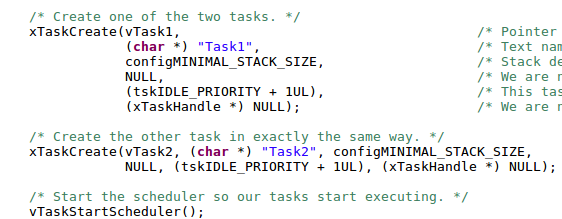

# 1.b)
## Documentación del ejemplo 1

Dentro del archivo se encuentran 9 ejemplos de FreeRTOS. Si bien cada uno cumple una función diferente, todos comparten ciertas características propias del uso del sistema operativo.

  

  Figura 1: Función donde se configura para el primer uso, a la placa.

A continuación se declaran las funciones que, durante la ejecución del programa, representan las tareas que ejecutará el sistema operativo.

  

  Figura 2: Declaración de las funciones que representan las tareas usadas en el programa.

La macro mainDELAY_LOOP_COUNT se utiliza posteriormente dentro del programa principal. Lo siguiente es definir estas tareas. 

  

  Figura 3: Definición de la tarea 1.

En la figura 3, la tarea cumple con el prototipo que debe tener es decir, retornar void y recibir un puntero a void. La tarea solamente enciende un LED y envía el mensaje de la variable “pcTaskName”: “Task 1 is running\r\n”. Por último realiza un delay con un ciclo for. Es un delay de la tarea, es decir, no es equivalente a invocar a la función vTaskDelay, que sí cede el control de CPU, hasta que expire ese timer. Entonces el rtos seguirá atendiendo a la tarea, es decir, seguirá en estado Ready. En la figura 4 se ve la tarea 2.

  

  Figura 4: Definición de la tarea 2.

La tarea 2 es idéntica a la tarea 1, solamente que apaga el LED y envía el mensaje “Task 2 is running\r\n”. 

Antes de continuar con el ejemplo, se analiza el archivo de configuración del FreeRTOS, “FreeRTOSConfig.h” para saber en qué modo está funcionando el sistema operativo.

  

  Figura 5: Captura del archivo FreeRTOSConfig.h, donde se puede ver cómo se configura al sistema operativo.

El sistema está configurado en modo **preemptive**, se definen **8** prioridades diferentes (tener en cuenta que esto corresponde a todos los ejemplos, no solo al 1), el tick interrupe al sistema cada **1000 ticks**.

Continuando con el main del ejemplo, lo primero que se hace es invocar a la función de la imagen 1, que configura la placa para su uso. Luego se imprime el mensaje *\r\nExample 1 - Creating tasks\r\n*. A continuación, en la imagen 6, se crea la tarea 1 invocando a la función **xTaskCreate**.

  

  Figura 6: Invocación de la función xTaskCreate, para la creación de las tareas 1 y 2. 

La función xTaskCreate es la encargada de crear la tarea correspondiente para que luego sea utilizada por el sistema operativo FreeRTOS. Esta recibe un puntero a la función asociada a la tarea, una string con el nombre de dicha tarea, el tamaño del stack en RAM que se le va a asignar a la tarea, los parámetros que utiliza la función, la prioridad de la misma y el handler de la tarea. Para la asignación de memoria esta se indica en cantidad de "palabras". En el caso de esta tarea, la memoria asignada es de 128 palabras de 16 bits, según se puede ver en la figura 5, donde se observa la definición de la macro *configMINIMAL_STACK_SIZE* que se le pasa a la tarea 1.

La función **xTaskCreate** se encuentra definida en el archivo *task.h* y se lo hace de la forma:

`#define xTaskCreate( pvTaskCode, pcName, usStackDepth, pvParameters, uxPriority, pxCreatedTask ) xTaskGenericCreate( ( pvTaskCode ), ( pcName ), ( usStackDepth ), ( pvParameters ), ( uxPriority ), ( pxCreatedTask ), ( NULL ), ( NULL ) )`

Es decir que es otra forma de invocar a la función **xTaskGenericCreate**. Esta se encuentra definida en el archivo *task.c*.

Al invocar a xTaskCreate, esta recibe como paráemtros una variable del tipo *TaskFunction_t* la cual se encuentra definida en el archivo *projdefs.h* y corresponde a otra forma de llamar a un puntero a void. Esta variable es el puntero a la función que ejecutará la tarea correspondiente. La variable de asignación de recursos es del tipo *UBaseType_t*. Esta se encuentra definida en el archivo *portmacro.h* y es otra forma de llamar a un **unsigned long**. Es decir que el tamaño de stack asignado a las tareas depende del tipo de arquitectura, es decir, qué considere la misma como unsigned long.

Para el caso de la prioridad asignada, se observa que a la tarea 1 se le asigna la prioridad *tskIDLE_PRIORITY + 1UL*. La tarea **IDLE** corresponde a la tarea de menor prioridad. Entonces se le está asignando a la tarea 1 una prioridad igual a la de la tarea IDLE + 1.

En la figura 6 también se muestra la creación de la tarea 2. Se puede ver que a esta se le asigna la misma prioridad que a la tarea 1. Como la macro *configUSE_PREEMPTION* vale 1, luego el sistema se configura en modo preemptive para tareas de diferentes prioridad y round-robin para tareas de igual prioridad. Es decir que las tareas 1 y 2 se van a ejecutar una seguida de la otra con un tiempo preestablecido e igual para ambas.

Para finalizar con el programa del ejemplo 1, se invoca a la función **vTaskStartScheduler**. La misma crea la tarea IDLE además de inicializar la ejecución de las tareas, estableciendo el orden de ejecución de las mismas. El resto del programa se puede ver en la figura 7.

  

  Figura 7: Resto del programa utilizado en el ejemplo 1 de FreeRTOS.

El **while(1)** solo se crea porque el programa va a estar gestionando e invocando a las diferentes tareas, es decir, no se realiza nada dentro del main.

# 2.b)
## Documentación del ejemplo 9

El ejemplo 9 plantea un codigo con el objeto de borrar un task en tiempo de ejecucion.
El codigo comienza definiendo tres punteros a char de entorno global (o tipo string) con los mensajes que posteriormente seran enviados por UART para ser vistos por el usuario.
Uno imprime el titulo del codigo por unica vez y los otros cuando se llama al task correspondiente.
Luego se definen los prototipos de los task utilizados en el codigo.
Por ultimo se genera la variable global xTask2Handle. Dicha variable en el fondo es un puntero a void. Dicha variable se explicara cuando se utilize.
Se observa el codigo en la figura X

  

  Figura X: Variable globales y definicion iniciales

A continuacion se explicaran los task del codigo.

La funcion vTask1 representa uno de los task (tareas) del codigo.
Cuando la misma es llamada define un puntero a char que lo carga con el parametro de entrada pvParameters
Basicamente como el prototipo de la funcion esta definido como un puntero a void este se debe castear explicitamente dentro de la funcion.
Luego el task entra en un loop infinito dado por el while
Dentro del while prendera un led, avisara por UART que tipo de task es y lo mas importante, creara un task nuevo.
El task nuevo tendra prioridad 2 y ademas se le pasara como parametro la direccion de la variable global definida anteriomente xTask2Handle.
Esta variable es un 'handler' (en castellano un manipulador) del task creado, basicamene es un puntero al task2.
Luego el task1 termina bloqueandose por 100ms.

  

  Figura X: Task 1

Por ende cuando se crea el task2 este se creara con prioridad mas alta y encima task1 estara bloqueado por tiempo. 
Este conjunto de eventos hara que se ejecute task2 completamente antes de volver a ejecutar nuevamente el task1.

La funcion creada vTask2 comienza similar a vTask1. Primero carga el parametro con el string y apaga el led que prendio vTask1.
Luego saca por UART el nombre del task y un mensaje que se esta por borrar ella misma.
Para borrarse utiliza vTaskDelete(xTask2Handle). A dicha funcion se le debe pasar como argumento un puntero al Task (el tipo de dato definido como 
 TaskHandle) para que se borre del scheduler.

  

  Figura X: Task 2

Por ultimo el main simplemente inicializa el hardware, imprime por UART el mensaje que esta en el main.
Luego solo crea el vTask1 con prioridad menor y sin ningun handler para luego inicializar el Scheduler y quedarse en un loop infinito
esperando ser cortado por los task.

  

  Figura X: Main ejemplo 9

# 3.a)
## Documentación del ejemplo 12

El ejemplo 12 muestra como utilizar tareas que están relacionadas a una interupción. La idea principal es que dicha tarea tiene una prioridad elevada pero se encuentra pausada esperando un semáforo, el cual es dado en el handler de interrupción del microcontrolador. Es importante distinguir que no se ejecuta la tarea en la interrupción sino que lo único que se hace en la interrupción es avisar al sistema operativo que dicha tarea está lista, lo cual permite tener control de prioridades ya que se podría estar ejecutando una tarea crítica que no debe ser interumpida (el razón por la que el handler de interrupción también debe ser corto).

En este ejemplo se dispara una interrupción via software activando un bit de uno de los registros del microcontrolador:

  

  Figura X1: Función donde se dispara manualmente la interrupción mediante software.

### Tareas
Las tareas de este ejemplo se pueden ver en la figura X2.

  

  Figura X2: Tareas del ejemplo.

vPeriodicTask: Tarea que se ejecuta cada 500 ms y que lo único que hace es disparar la interrupción via software. Tiene prioridad baja (1).

  

  Figura X3: Tarea periódica.

vHandlerTask: Es la tarea que se debe ejecutar como producto de la interrupción. Para este ejemplo en particular lo único que hace es conmutar el estado de un LED y tomar el semáforo para ponerse en espera. Tiene una prioridad 3 tal que se ejecutará por encima de vPeriodicTask cuando esté habilitada.

  

  Figura X4: Tarea asociada a la interrupción.

### Función de interrupción:

La rutina de interrupción se puede ver en la figura X5.

  

  Figura X5: Definición del handler de la interrupción.

vSoftwareInterruptHandler: es una macro que en realidad se define como DAC_IRQHandler, es decir es la rutina de interrupción asociada al DAC (cuya interrupción se activa por software en vPeriodicTask). Lo que hace esta rutina de interrupción es dar el semáforo tal que habilite a vHandlerTask y poder forzar un cambio de contexto. El hecho de forzar el cambio de contexto puede hacer que la tarea se ejecute casi instantáneamente, casi como si fuera una interrupción, pero al estar bajo el control del sistema operativo puede que se deba esperar a que termine alguna otra tarea con mayor prioridad.

El semáforo se da con la función xSemaphoreGiveFromISR(), la cual difiere de xSemaphoreGive() en que recibe un parámetro adicional llamado pxHigherPriorityTaskWoken. Este parámetro es un puntero a una variable auxiliar tal de poder avisar si hay alguna tarea con prioridad mayor a la tarea actual despertada por haber dado este semáforo. Es en este caso que se fuerza un cambio de contexto (si no se despertó nada no sería necesario). 

De la documentación de FreeRTOS
>xSemaphoreGiveFromISR() will set *pxHigherPriorityTaskWoken to pdTRUE if giving the semaphore caused a task to unblock, and the >unblocked task has a priority higher than the currently running task. If xSemaphoreGiveFromISR() sets this value to pdTRUE then a >context switch should be requested before the interrupt is exited.

### Main
La función main(), como en la mayoría de los ejemplos, se encarga de inicializar el hardware, crear las tareas e invocar al scheduler pero con el agregado de también configurar la prioridad de la interrupción DAC_IRQHandler (cuyo ID está definido en mainSW_INTERRUPT_ID) llamando a la función prvSetupSoftwareInterrupt(). Dicha configuración se puede ver en la figura X6 y no es para FreeRTOS sino que es propia del microcontrolador (funciones del Nested Vectored Interrupt Controller).

  

  Figura X6: Configuración de la prioridad de la interrupción de NVIC.

[FALTA LA FOTITO CON EL GRAFICO DEL TIEMPO, VS TAREAS EJECUTADAS]
[Cambiar el valor de la figuras].

